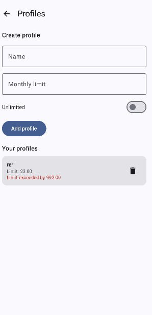
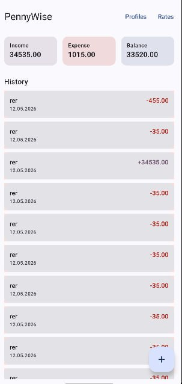
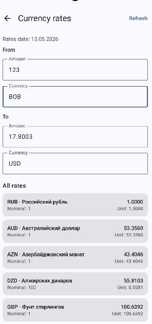

# PennyWise — Трекер личных финансов


## Description
**PennyWise** — это современное мобильное приложение для ОС Android, предназначенное для учета личных доходов и расходов, а также умного контроля бюджета. Приложение позволяет создавать профили пользователей, устанавливать финансовые лимиты, отслеживать историю транзакций и конвертировать валюты в реальном времени, используя внешний XML API Центрального банка РФ. 

Проект реализует продвинутый многооконный пользовательский интерфейс с использованием **Jetpack Compose** и библиотеки **Decompose** для навигации. Надежное локальное хранение данных (профили и история операций) обеспечивается базой данных **SQLite** посредством архитектурного компонента **Room**. Приложение работает плавно благодаря вынесению тяжелых сетевых запросов и операций с БД в фоновые потоки с использованием **Kotlin Coroutines**. Также реализованы современные элементы тач-взаимодействия — удаление записей с помощью жеста свайпа.

## Installation
Для локальной установки, тестирования и запуска проекта выполните следующие шаги:

1. **Склонируйте репозиторий** на свой компьютер, используя Git:
   ```bash
   git clone https://github.com/kirieshki24/pennywise.git
   ```
2. **Откройте проект** в Android Studio (рекомендуется версия *Iguana* или новее).
3. Дождитесь окончания синхронизации **Gradle** (в проекте настроена кодогенерация через встроенный KSP).
4. Выберите виртуальный эмулятор (с версией Android 8.0 / API 26 или выше) или подключите физическое Android-устройство.
5. Убедитесь, что на устройстве включен интернет (требуется для работы конвертера валют).
6. Нажмите кнопку **Run** (`Shift + F10`) для сборки и установки приложения.

---

## Usage
Приложение разделено на несколько логических экранов, обеспечивающих полный цикл работы с финансами.

### 1. Создание профиля и установка лимитов
При первом запуске пользователю предлагается создать профиль для учета средств.
* Введите имя профиля.
* Установите **месячный лимит трат**. 
* Если вы не хотите ограничивать свои траты, активируйте переключатель (Switch) **«Unlimited»**, который автоматически заблокирует поле ввода лимита.

Экран создания профиля
 

### 2. Контроль расходов (Превышение лимита)
На главном экране отображается текущий баланс и кнопка добавления новой транзакции (Floating Action Button).
* Нажмите `+`, введите сумму и выберите тип: *Доход* или *Расход*.
* **Умный контроль:** Если введенная сумма расхода приведет к превышению заданного лимита профиля, приложение приостановит сохранение и выведет всплывающее диалоговое окно (Dialog) с предупреждением: *"Ваш лимит превышен на N руб. Вы уверены, что хотите продолжить?"*.
* Для удаления ошибочной записи используйте тач-жест **Swipe-to-Dismiss** — просто смахните карточку транзакции пальцем влево или вправо. Запись мгновенно удалится из локальной базы данных, а баланс будет пересчитан.

Главная страница
 

### 3. Конвертер валют (Работа с сетью)
Отдельная вкладка приложения предоставляет доступ к конвертеру валют.
* При открытии экрана приложение делает асинхронный HTTP-запрос к открытому **API ЦБ РФ**, скачивает XML-файл и парсит его. В это время отображается индикатор загрузки.
* Выберите нужные валюты из двух выпадающих списков. При вводе числа в одно поле, второе поле автоматически пересчитывается по актуальному кросс-курсу к рублю.

Загрузка курсов (API), Конвертация валют


---

## Contributing
Проект разработан командой студентов в рамках курса «ПВМС». Для управления процессом разработки использовалась методология Kanban и доска **GitHub Projects**. 

Задачи в проекте были распределены следующим образом:
